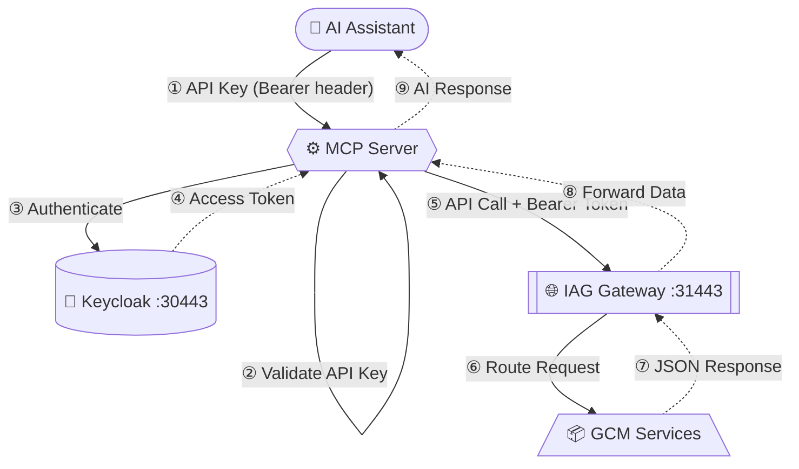
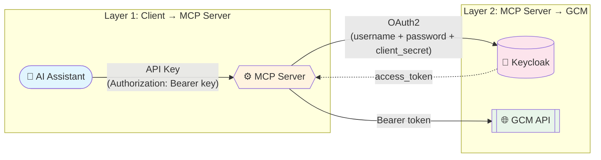
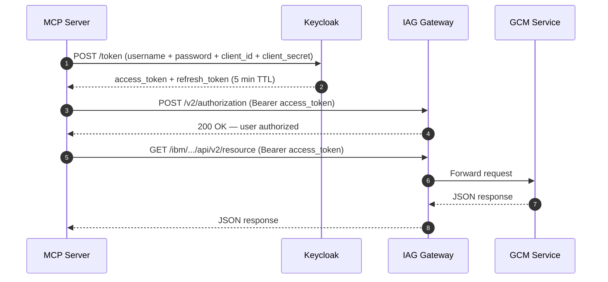
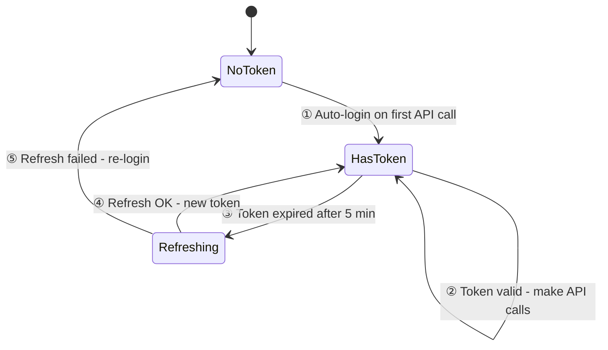

# GCM MCP Server

Model Context Protocol (MCP) server for IBM Guardium Cryptography Manager (GCM) 2.0 — Access 292 GCM REST API endpoints through just 3 intelligent MCP tools.

Ask your AI assistant to list cryptographic assets, manage TDE keys, run discovery scans, check policy compliance — all without writing API calls or navigating the GCM console.


---

## What You Can Do

The server provides three tools that your AI assistant discovers automatically:

| Tool | What it does |
|------|-------------|
| `gcm_auth` | Manage authentication — login, logout, check status |
| `gcm_api` | Run any GCM operation — list users, create keys, scan assets, check policies |
| `gcm_discover` | Browse available APIs — find endpoints, view parameters, explore services |

**Example prompts you can use:**

- *"Show me all cryptographic assets discovered in the last 7 days"*
- *"List all TDE encryption keys and their expiration dates"*
- *"Run a discovery scan on the Oracle database server"*
- *"Which policies have active violations?"*
- *"Create a new user with read-only access"*

Authentication happens automatically — the server logs into GCM on your first request and refreshes the token as needed. No passwords in your prompts, ever.

---

## Architecture


```mermaid
%%{init: {'theme': 'default'}}%%
flowchart TB
    A(["🤖 AI Assistant"])
    B{{"⚙️ MCP Server"}}
    C[("🔐 Keycloak :30443")]
    D[["🌐 IAG Gateway :31443"]]
    E[/"📦 GCM Services"\]

    A -->|"① API Key (Bearer header)"| B
    B -->|② Validate API Key| B
    B -->|③ Authenticate| C
    C -.->|④ Access Token| B
    B -->|⑤ API Call + Bearer Token| D
    D -->|⑥ Route Request| E
    E -.->|⑦ JSON Response| D
    D -.->|⑧ Forward Data| B
    B -.->|⑨ AI Response| A
```

**How it works — step by step:**

| Step | What happens |
| ---- | --------------------------------------------------------------- |
| ① | AI assistant sends a request to MCP Server **with API key in the `Authorization` header** |
| ② | MCP Server **validates the API key** — rejects with `401 Unauthorized` if missing or wrong |
| ③ | MCP Server sends GCM credentials to Keycloak (GCM's identity provider) |
| ④ | Keycloak validates and returns an `access_token` (5 min TTL) |
| ⑤ | MCP Server calls IAG Gateway with `Bearer <token>` |
| ⑥ | IAG routes the request to the correct GCM microservice |
| ⑦ | GCM service processes and returns JSON |
| ⑧ | IAG passes the response back to MCP Server |
| ⑨ | MCP Server formats and returns the answer to the AI assistant |

> **→ solid arrows** = request &nbsp;&nbsp; **⇢ dotted arrows** = response

---

## Prerequisites

Before setting up the MCP server, you need the following:

| # | What | Where to get it |
|---|------|-----------------|
| 1 | **GCM 2.0 server** (running and accessible) | Deployed on a VM/server with K3s |
| 2 | **GCM login credentials** (`GCM_USERNAME` / `GCM_PASSWORD`) | Your GCM admin account (e.g., `gcmadmin@gcm.local`) |
| 3 | **OIDC client credentials** (`GCM_CLIENT_ID` / `GCM_CLIENT_SECRET`) | Extract from K8s secret on the GCM server (see below) |
| 4 | **MCP API Key** (`GCM_MCP_API_KEY`) | Generate locally (see below) |
| 5 | **Docker** (for container deployment) or **Python 3.10+** (for source) | [docker.com](https://docs.docker.com/get-docker/) or [python.org](https://www.python.org/downloads/) |
| 6 | **An MCP-compatible AI assistant** | VS Code (Copilot), Claude Desktop, IBM Bob, or Cursor |

### Step 1: Get the OIDC Client Credentials from GCM

```bash
ssh root@<gcm-server>
export KUBECONFIG=/etc/rancher/k3s/k3s.yaml

# Client ID (usually 'gcmclient')
kubectl get secret oidc-client-secret -n gcmapp \
  -o jsonpath='{.data.CLIENT_ID}' | base64 -d && echo

# Client Secret
kubectl get secret oidc-client-secret -n gcmapp \
  -o jsonpath='{.data.CLIENT_SECRET}' | base64 -d && echo
```

### Step 2: Generate an MCP API Key

```bash
# Generate a secure 64-character hex key
export GCM_MCP_API_KEY=$(openssl rand -hex 32)
echo "Your MCP API Key: $GCM_MCP_API_KEY"
# Save this — you'll need it for both the server and client config
```

> **Why an API key?** Without it, anyone who can reach the MCP server's port can control GCM through it. The API key ensures only authorized AI assistants can connect. See [Security](#security) for details.

---

## Getting Started

### Option 1: Use the Pre-Built Container (Recommended)

```bash
docker pull ghcr.io/ibm/gcm-mcp-server:latest

docker run -d \
  --name gcm-mcp-server \
  --restart unless-stopped \
  -p 8002:8002 \
  -e GCM_HOST="<gcm-server-ip>" \
  -e GCM_USERNAME="<your-gcm-username>" \
  -e GCM_PASSWORD="<your-gcm-password>" \
  -e GCM_CLIENT_ID="gcmclient" \
  -e GCM_CLIENT_SECRET="<from-step-1>" \
  -e GCM_MCP_API_KEY="<from-step-2>" \
  ghcr.io/ibm/gcm-mcp-server:latest
```

Verify it's running:

```bash
curl http://localhost:8002/health
```

The image supports both `linux/amd64` and `linux/arm64`.

### Option 2: Run from Source

```bash
git clone https://github.com/IBM/gcm-mcp-server.git
cd gcm-mcp-server
pip install -e .

export GCM_HOST=<gcm-server-ip>
export GCM_USERNAME=<your-gcm-username>
export GCM_PASSWORD=<your-gcm-password>
export GCM_CLIENT_SECRET=<from-step-1>
export GCM_MCP_API_KEY=<from-step-2>

python -m src.server
```

---

## Connecting Your AI Assistant

### VS Code (GitHub Copilot)

Add to `.vscode/mcp.json` in your project (or VS Code user settings):

```json
{
  "servers": {
    "gcm-mcp-server": {
      "type": "sse",
      "url": "http://<mcp-server-host>:8002/sse",
      "headers": {
        "Authorization": "Bearer <your-mcp-api-key>"
      }
    }
  }
}
```

### Claude Desktop

Add to `~/Library/Application Support/Claude/claude_desktop_config.json`:

```json
{
  "mcpServers": {
    "gcm-mcp-server": {
      "type": "sse",
      "url": "http://<mcp-server-host>:8002/sse",
      "headers": {
        "Authorization": "Bearer <your-mcp-api-key>"
      },
      "alwaysAllow": ["gcm_auth", "gcm_api", "gcm_discover"]
    }
  }
}
```

### IBM Bob

Add to `~/Library/Application Support/IBM Bob/User/globalStorage/ibm.bob-code/settings/mcp_settings.json`:

```json
{
  "mcpServers": {
    "gcm-mcp-server": {
      "type": "sse",
      "url": "http://<mcp-server-host>:8002/sse",
      "headers": {
        "Authorization": "Bearer <your-mcp-api-key>"
      },
      "alwaysAllow": ["gcm_auth", "gcm_api", "gcm_discover"]
    }
  }
}
```

### Verify the Connection

After restarting your AI assistant, try:

> *"Use gcm_discover to list all available GCM services"*

You should see 11 services: usermanagement, tde, assetinventory, discovery, policy, policyrisk, audit, integration, notifications, clm, config.

> **Note:** GCM credentials are configured on the server side. Your AI assistant config needs the server URL **and the MCP API key** — no GCM passwords in the client config.

---

## Security

The MCP server has **two layers of authentication** — one to protect the MCP server itself, and one to authenticate with GCM.


```mermaid
%%{init: {'theme': 'default'}}%%
flowchart LR
    subgraph "Layer 1: Client → MCP Server"
        A(["🤖 AI Assistant"]) -->|"API Key\n(Authorization: Bearer key)"| B{{"⚙️ MCP Server"}}
    end

    subgraph "Layer 2: MCP Server → GCM"
        B -->|"OAuth2\n(username + password + client_secret)"| C[("🔐 Keycloak")]
        C -.->|"access_token"| B
        B -->|"Bearer token"| D[["🌐 GCM API"]]
    end

    style A fill:#e1f5fe
    style B fill:#fff3e0
    style C fill:#fce4ec
    style D fill:#e8f5e9
```

| Layer | What it protects | How it works |
|-------|-----------------|---------------|
| **Layer 1 — MCP API Key** | Prevents unauthorized clients from connecting to the MCP server | Client sends `Authorization: Bearer <GCM_MCP_API_KEY>` header. MCP server rejects requests without a valid key with `401 Unauthorized`. |
| **Layer 2 — GCM OAuth2** | Authenticates the MCP server to GCM's APIs via Keycloak | MCP server uses `GCM_USERNAME` + `GCM_PASSWORD` + `GCM_CLIENT_SECRET` to get an OAuth2 token from Keycloak. Token auto-refreshes every 5 min. |

### Generating an MCP API Key

Generate a random key and set it as an environment variable on the server:

```bash
# Generate a secure random API key
export GCM_MCP_API_KEY=$(openssl rand -hex 32)
echo $GCM_MCP_API_KEY   # Save this — you'll need it for client config
```

Then add the same key to your AI assistant's MCP config (see [Connecting Your AI Assistant](#connecting-your-ai-assistant)).

> **`GCM_MCP_API_KEY` is mandatory for network transports (SSE/REST).** The server **refuses to start** in SSE or REST mode without this key. It prevents unauthorized clients from using the deployed server as a proxy to GCM using the admin's credentials. stdio is exempt — the user runs the process locally with their own GCM credentials; GCM Keycloak (Layer 2) is the security gate.

---

## GCM Authentication

GCM uses [Keycloak](https://www.keycloak.org/) as its identity provider. Instead of authenticating directly with GCM, all login requests go through Keycloak's OAuth2/OIDC token endpoint. This is how GCM secures its APIs — every API call requires a Bearer token issued by Keycloak.

The MCP server handles this entirely for you. Credentials are set once in environment variables — you never include passwords in your prompts or tool calls.


```mermaid
sequenceDiagram
    autonumber
    participant M as MCP Server
    participant K as Keycloak
    participant I as IAG Gateway
    participant G as GCM Service

    M->>K: POST /token (username + password + client_id + client_secret)
    K-->>M: access_token + refresh_token (5 min TTL)
    M->>I: POST /v2/authorization (Bearer access_token)
    I-->>M: 200 OK — user authorized
    M->>I: GET /ibm/.../api/v2/resource (Bearer access_token)
    I->>G: Forward request
    G-->>I: JSON response
    I-->>M: JSON response
```

**Step-by-step breakdown:**

| Step | Arrow | What happens |
| ---- | --------------- | --------------------------------------------------------------------- |
| 1 | MCP → Keycloak | Send your GCM credentials + OIDC client credentials to Keycloak |
| 2 | Keycloak → MCP | Receive `access_token` (expires in 300s) and `refresh_token` |
| 3 | MCP → IAG | Authorize the token with GCM's user management service |
| 4 | IAG → MCP | GCM confirms the user is valid and authorized |
| 5 | MCP → IAG | Make actual API call (e.g., list users, create key) with Bearer token |
| 6 | IAG → GCM | IAG routes to the correct microservice |
| 7 | GCM → IAG | Service returns the result |
| 8 | IAG → MCP | Response forwarded back to MCP Server |

> **Token refresh:** When the token expires after 5 minutes, the MCP Server automatically uses the `refresh_token` to get a new `access_token` — no re-login needed.

### Token Lifecycle


```mermaid
stateDiagram-v2
    [*] --> NoToken
    NoToken --> HasToken: ① Auto-login on first API call
    HasToken --> HasToken: ② Token valid - make API calls
    HasToken --> Refreshing: ③ Token expired after 5 min
    Refreshing --> HasToken: ④ Refresh OK - new token
    Refreshing --> NoToken: ⑤ Refresh failed - re-login
```

You don't need to manage any of this — the MCP server handles login, refresh, and re-login automatically.

### Credentials You Need

The MCP server requires **two sets of credentials**, both set as environment variables:

| Credential | Purpose | How to Obtain |
| --- | --- | --- |
| **GCM_USERNAME / GCM_PASSWORD** | Your identity for GCM | Your GCM login credentials |
| **GCM_CLIENT_ID / GCM_CLIENT_SECRET** | OAuth2 client for Keycloak | From a Kubernetes secret on the GCM server |

**Why two sets?** Your username/password prove *who you are*. The client ID/secret prove *which application* is requesting the token. Keycloak requires both to issue an access token.

**Retrieve the OIDC client credentials from the GCM server:** See [Prerequisites — Step 1](#step-1-get-the-oidc-client-credentials-from-gcm).

---

## Available GCM Services

| Service | What you can manage | Example prompt |
|---------|-------------------|----------------|
| User Management | Users, roles, licenses | *"List all GCM users and their roles"* |
| TDE | Encryption keys, certificates, TDE clients | *"Show TDE keys expiring this month"* |
| Asset Inventory | Cryptographic objects, IT assets | *"How many crypto assets use RSA-2048?"* |
| Discovery | Scan profiles, discovery jobs | *"Run a discovery scan on server db-prod-01"* |
| Policy | Compliance policies, rules | *"Which policies are currently violated?"* |
| Audit | Audit logs, activity reports | *"Show audit events from the last 24 hours"* |
| Integration | SIEM, KMS connections | *"List all configured SIEM integrations"* |
| Notifications | Alert rules, channels | *"What notification channels are set up?"* |
| CLM | Certificate lifecycle | *"List certificates expiring in 30 days"* |
| Config | System configuration | *"Show current system settings"* |
| Policy Risk | Violations, risk evaluation | *"List all high-severity violations"* |

**Total API coverage:** 292 endpoints across GET, POST, PUT, DELETE operations.

---

## Configuration Reference

| Variable | Required | Default | Description |
|----------|----------|---------|-------------|
| `GCM_HOST` | Yes | — | GCM server IP or hostname |
| `GCM_API_PORT` | No | `31443` | API gateway port |
| `GCM_KEYCLOAK_PORT` | No | `30443` | Keycloak port |
| `GCM_USERNAME` | Yes | — | Your GCM username |
| `GCM_PASSWORD` | Yes | — | Your GCM password |
| `GCM_CLIENT_ID` | No | `gcmclient` | OIDC client ID |
| `GCM_CLIENT_SECRET` | Yes | — | OIDC client secret (from K8s) |
| `GCM_AUTH_MODE` | No | `oauth2` | Authentication mode |
| `GCM_VERIFY_SSL` | No | `false` | SSL certificate verification |
| `GCM_REQUEST_TIMEOUT` | No | `30` | API timeout in seconds |
| `GCM_MCP_API_KEY` | **Yes*** | — | API key for client auth. Required for SSE/REST (network). Not needed for stdio (local). |

You can set these as environment variables or in a `.env` file alongside the server.

> **\*** `GCM_MCP_API_KEY` is **mandatory for SSE and REST** (server exits with fatal error if not set). Not enforced for stdio because the user runs locally with their own GCM credentials — Keycloak (Layer 2) authenticates them directly.

---

## Resources

- [IBM Guardium CM 2.0 Documentation](https://www.ibm.com/docs/en/guardium-cm/2.0.0)
- [GCM Swagger API Reference](https://www.ibm.com/docs/en/guardium-cm/2.0.0?topic=apis-swagger-api)
- [Container Image on ghcr.io](https://github.com/orgs/IBM/packages/container/package/gcm-mcp-server)

---

## Support

**Found a bug?** [Open an issue](https://github.com/IBM/gcm-mcp-server/issues/new) with steps to reproduce and server logs.

**Feature request?** [Open an issue](https://github.com/IBM/gcm-mcp-server/issues/new) with `[Feature Request]` prefix.

**Questions?** Check [existing issues](https://github.com/IBM/gcm-mcp-server/issues) or open a new one.

---

## IBM Public Repository Disclosure

All content in this repository including code has been provided by IBM under the associated open source software license and IBM is under no obligation to provide enhancements, updates, or support. IBM developers produced this code as an open source project (not as an IBM product), and IBM makes no assertions as to the level of quality nor security, and will not be maintaining this code going forward.

---

> **Disclaimer:** This is a Minimum Viable Product (MVP) for testing and demonstration purposes only. Not for production use. No warranty or support guarantees.
