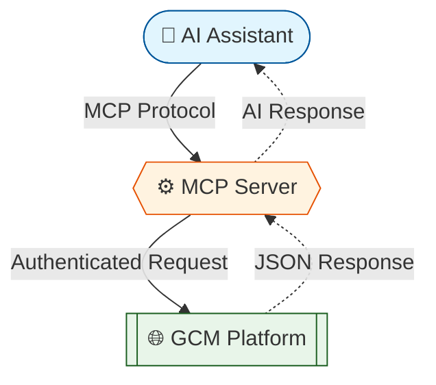
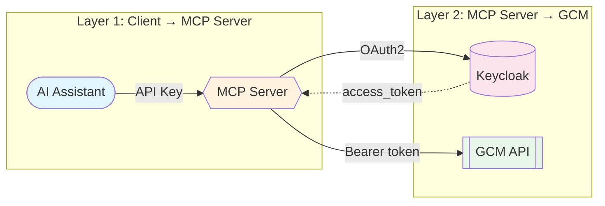

# GCM MCP Server

Let AI agents manage your entire cryptographic inventory — discover vulnerable keys, enforce policies, and prepare for post-quantum migration.

## What You Can Do

- **Find quantum-vulnerable cryptography** — scan your environment for weak algorithms, short key lengths, and certificates that won't survive quantum computing
- **Generate crypto bill of materials (CBOM)** — get a complete inventory of every key, certificate, and algorithm across your organization
- **Enforce key rotation compliance** — identify expired or soon-to-expire certificates and keys before they cause outages
- **Manage crypto policies at scale** — review and enforce cryptographic standards across all managed keystores from one conversation

## Compatible With

IBM Bob · Claude Desktop · VS Code Copilot · watsonx Orchestrate · Any MCP-compatible AI assistant

---

## Architecture

```mermaid
%%{init: {'theme': 'default'}}%%
flowchart TB
    A(["🤖 AI Assistant"])
    B{{"⚙️ MCP Server"}}
    D[["🌐 GCM Platform"]]

    A -->|"MCP Protocol"| B
    B -->|"Authenticated Request"| D
    D -.->|"JSON Response"| B
    B -.->|"AI Response"| A

    style A fill:#e1f5fe,stroke:#01579b
    style B fill:#fff3e0,stroke:#e65100
    style D fill:#e8f5e9,stroke:#1b5e20
```

## Security

```mermaid
%%{init: {'theme': 'default'}}%%
flowchart LR
    subgraph "Layer 1: Client → MCP Server"
        A(["AI Assistant"]) -->|"API Key"| B{{"MCP Server"}}
    end

    subgraph "Layer 2: MCP Server → GCM"
        B -->|"OAuth2"| C[("Keycloak")]
        C -.->|"access_token"| B
        B -->|"Bearer token"| D[["GCM API"]]
    end

    style A fill:#e1f5fe
    style B fill:#fff3e0
    style C fill:#fce4ec
    style D fill:#e8f5e9
```

---

## Contact

**Maintainer:** Anuj Shrivastava — AI Engineer, US Industry Market - Service Engineering

📧 [ashrivastava@ibm.com](mailto:ashrivastava@ibm.com)

For demos, integration help, or collaboration — reach out via email.

> **Disclaimer:** This is a Minimum Viable Product (MVP) for testing and demonstration purposes only. Not for production use. No warranty or support guarantees.

## IBM Public Repository Disclosure

All content in this repository including code has been provided by IBM under the associated open source software license and IBM is under no obligation to provide enhancements, updates, or support. IBM developers produced this code as an open source project (not as an IBM product), and IBM makes no assertions as to the level of quality nor security, and will not be maintaining this code going forward.
